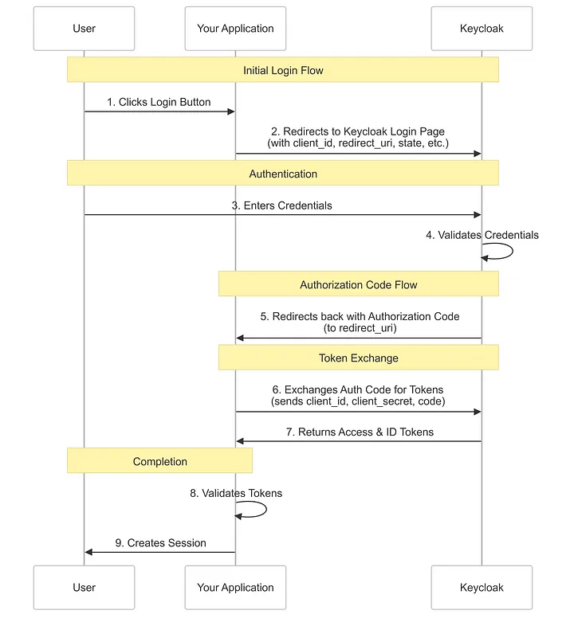

# passIt backend

A modern password management and sharing platform built with Go, Keycloak, and PostgreSQL.

## Table of Contents
- [Getting Started](#getting-started)
- [Prerequisites](#prerequisites)
- [Database Migration](#database-migration)
- [Local Development](#local-development)
- [Makefile Commands](#makefile-commands)
- [Project Structure](#project-structure)
- [Environment Variables](#environment-variables)
- [PassIt Authentication](#authentication)
- [License](#license)

## Getting Started

Follow these instructions to set up the project for local development and testing.

## Prerequisites
- Go 1.24.0 or higher
- Docker & Docker Compose

## Database Migration

Run database migrations:
```bash
go run ./internal/database/migration/migration.go
```

## Local Development

### Partial development

With docker-compose.yml file a functional application will start
Start Core Services:
- Database
- Keycloak
- Redis
```bash
docker-compose up -d
```
Run the Go application:
```bash
make run
```

### Full developement

Start all Services:
- Database
- Keycloak
- Redis
- Elasticsearch
- Kibana(ElasticSearch UI)
- Filebeat
- PassIt backend(If there is no need for that you can comment it out)
```bash
docker-compose -f docker-compose-full.yml up --build -d
```

## MakeFile

Run build make command with tests
```bash
make all
```

Build the application
```bash
make build
```

Run the application
```bash
make run
```
Create DB container
```bash
make docker-run
```

Shutdown DB Container
```bash
make docker-down
```

DB Integrations Test:
```bash
make itest
```

Live reload the application:
```bash
make watch
```

Run the test suite:
```bash
make test
```

Clean up binary from the last build:
```bash
make clean
```

## Environment Variables
An .env file in the root directory is needed with the following variables:
```bash
PORT=8080
APP_ENV=local

# Database
DB_HOST=localhost
DB_PORT=5432
DB_DATABASE=passit
DB_USERNAME=melkey
DB_PASSWORD=password1234
DB_SCHEMA=public

# Redis
REDIS_HOST=localhost
REDIS_PORT=6379
REDIS_DATABASE=0
REDIS_USERNAME=default
REDIS_PASSWORD=redis_password

# Keycloak
KEYCLOAK_URL=https://localhost:8443
KEYCLOAK_REALM=passit
KEYCLOAK_CLIENT_ID=passit-app
KEYCLOAK_CLIENT_SECRET=your_client_secret
```

## Authentication

This project uses [Keycloak](https://www.keycloak.org/) as the authentication provider.  
Keycloak handles user login, registration, and token issuance for secure access to protected resources.

- **Login Flow:**  
  The authentication process with Keycloak involves several steps and handlers that work together to secure the application. Users are redirected to Keycloak for authentication. Upon successful login, Keycloak issues tokens that are used to access protected endpoints in the backend.

  

  The key points:
  - /auth/login - Initiates the authentication process
  - /auth/callback - Handles the OAuth2 callback from Keycloak

- **Protected Routes:**  
  Most backend routes require a valid access token. The backend verifies tokens using Keycloak’s OIDC endpoints.

- **Session Management:**  
  User sessions and tokens are managed using Redis for fast access and scalability.

- **Configuration:**  
  Keycloak connection details (URL, realm, client ID, client secret) are set via environment variables in your `.env` file:
  ```env
  KEYCLOAK_URL=https://localhost:8443
  KEYCLOAK_REALM=passit
  KEYCLOAK_CLIENT_ID=passit-app
  KEYCLOAK_CLIENT_SECRET=your_client_secret
  ```

- **Login Page:**  
  The login page is served at `/` and provides a "Login with Keycloak" button, which redirects users to the Keycloak login screen.

- **Customizing Authentication:**  
  You can adjust authentication logic in `internal/server/middleware.go` and `internal/server/routes.go`.

For more details on configuring Keycloak, see the [Keycloak documentation](https://www.keycloak.org/documentation).
